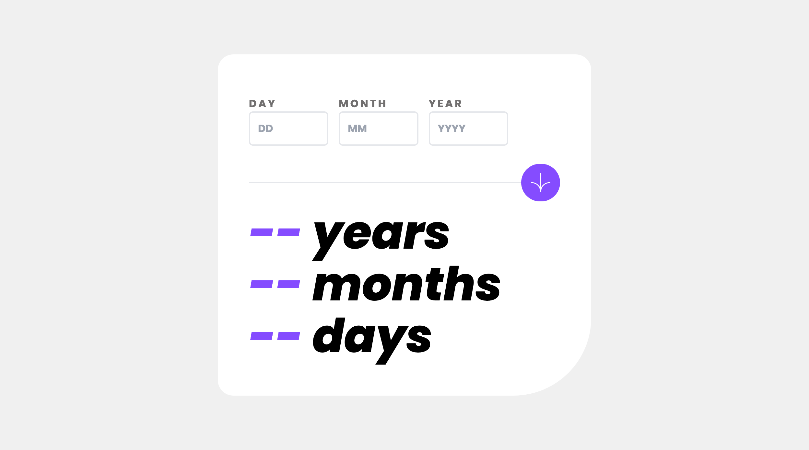
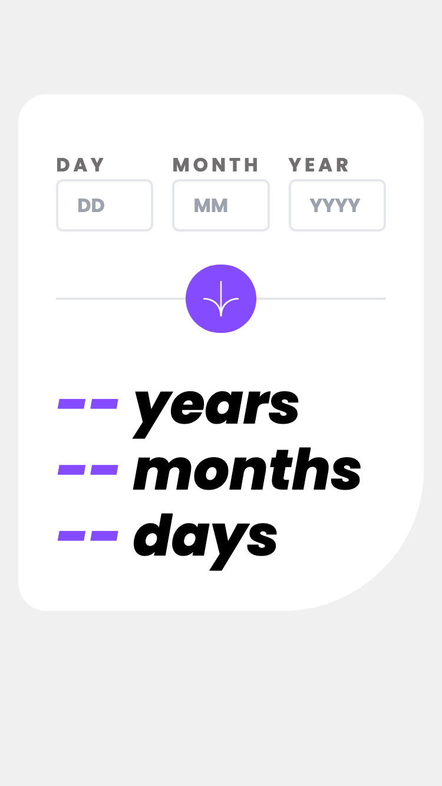

# Frontend Mentor - Age calculator app solution

This is a solution to the [Age calculator app challenge on Frontend Mentor](https://www.frontendmentor.io/challenges/age-calculator-app-dF9DFFpj-Q). Frontend Mentor challenges help you improve your coding skills by building realistic projects.

## Table of contents

- [Overview](#overview)
  - [The challenge](#the-challenge)
  - [Screenshot](#screenshot)
  - [Links](#links)
- [My process](#my-process)
  - [Built with](#built-with)
  - [What I learned](#what-i-learned)
  - [Useful resources](#useful-resources)

## Overview

### The challenge

Users should be able to:

- View an age in years, months, and days after submitting a valid date through the form
- Receive validation errors if:
  - Any field is empty when the form is submitted
  - The day number is not between 1-31
  - The month number is not between 1-12
  - The year is in the future
  - The date is invalid e.g. 31/04/1991 (there are 30 days in April)
- View the optimal layout for the interface depending on their device's screen size
- See hover and focus states for all interactive elements on the page

### Screenshot

|  |  |
| ------------------------------------------------ | ----------------------------------------------- |

### Links

- [My Solution]()
- [Live Site URL]()

## My process

### Built with

- Semantic HTML5 markup
- CSS custom properties
- Flexbox
- CSS Grid
- Mobile-first workflow
- Tailwind CSS
- DOM Manipulation
- Javascript

### What I learned

1. Implementing form validation to ensure valid user input.
1. Manipulating dates using JavaScript's Date object.
1. Updating the DOM dynamically for interactive user interfaces.

### Useful resources

#### - [Stackoverflow](https://stackoverflow.com/) - A valuable platform for finding solutions to programming challenges and troubleshooting issues.

#### - [MDN DOCS](https://developer.mozilla.org/) - An excellent resource for comprehensive documentation on HTML, CSS, and JavaScript.

#### - [Google Fonts](https://fonts.google.com/) - For all kinds of font styles, this is highly recommended.

#### - [Tailwind css](https://tailwindcss.com/) - The official tailwind css documentation.

#### - [ChatGPT by OpenAI](https://openai.com/) - A powerful language model that can assist in generating code snippets, answering questions, and providing guidance during development.
